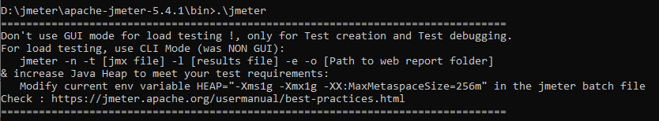
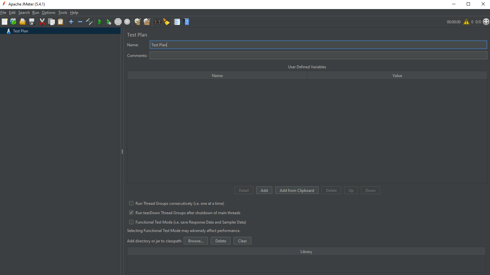

# Apache JMeter

## Czym jest Apache JMeter™?

**Apache JMeter** to narzędzie napisane w języku Java i będące oprogramowaniem open-source. 
JMeter jest wykorzystywany do analizy i oceny wydajności aplikacji webowych, lub różnorodnych usług internetowych.
Testowanie wydajności oznacza testowanie aplikacji webowych w przypadku dużego obciążenia i wzmożonego ruchu internetowego.
Początkowo JMeter był używany tylko do testowania aplikacji webowych i aplikacji FTP. Obecnie jest używany do testów funkcjonalnych, testów serwerów baz danych itp.

## Zalety JMeter
- Licencja Open Source
- Wizualizacja wyników
- Przyjazne GUI
- Szeroka dokumentacja i mnogość tutoriali- Łatwa instalacji
- Dodatkowe pluginy
- Obsługa wielu protokołów
- Niezależność od platformy
- Możliwość integracji z Bean Shell i Selenium do testów automatycznych

## Instalacja JMeter
1. Pobieramy archiwum z sekcji **Binaries** ze strony JMeter - [Pobierz][https://jmeter.apache.org/download_jmeter.cgi]
2. W zależności od pobranej wersji sprawdzamy jakie są dla niej minimalne wymagania wobec wersji Java i instalujemy wskazaną wersję w razie potrzeby. Upewniamy się także, że zmienna środowiskowa 'JAVA_HOME' jest ustawiona i wskazuje na prawidłową wersję.
3. Wypakowujemy pobrane archwium do wybranego przez nas folderu.
4. Otwieramy JMeter UI za pomocą konsoli systemowej:
 - na Windowsie: przechodzimy do lokalizaji '<jmeter_location>\bin' i uruchamiamy jmeter.sh.
 - na Lnuxie/Macu: przechodzimy do lokalizaji '<jmeter_location>/bin' i uruchamiamy jmeter.sh.
 
 Przykładowo:
 

Jeśli otworzy nam się okno JMeter UI, to oznacza że instalacja przebiegła pomyślnie.

 

 ## Zarządzanie pluginami
 1. Ze strony [JMeter Plugins Manager][https://jmeter-plugins.org/wiki/PluginsManager/] pobieramy plik JAR.
 2. Pobrany plik kopiujemy do katalogu, gdzie wcześniej zainstalowaliśmy JMeter: **lib/ext**.
 3. Ponownie uruchamiamy JMeter i w zakładce **Options** znajdziemy **Plugin Manager** skąd możemy pobrać dodatki przydatne podczas przeprowadzania testów wydajnościowych.
 
 ## Przykład użycia (Testplan)

'<?xml version="1.0" encoding="UTF-8"?>
<jmeterTestPlan version="1.2" properties="2.7" jmeter="2.12 r1636949">
  <hashTree>
    <TestPlan guiclass="TestPlanGui" testclass="TestPlan" testname="Test Plan" enabled="true">
      <stringProp name="TestPlan.comments"></stringProp>
      <boolProp name="TestPlan.functional_mode">false</boolProp>
      <boolProp name="TestPlan.serialize_threadgroups">false</boolProp>
      <elementProp name="TestPlan.user_defined_variables" elementType="Arguments" guiclass="ArgumentsPanel" testclass="Arguments" testname="User Defined Variables" enabled="true">
        <collectionProp name="Arguments.arguments"/>
      </elementProp>
      <stringProp name="TestPlan.user_define_classpath"></stringProp>
    </TestPlan>
    <hashTree>
      <ConfigTestElement guiclass="HttpDefaultsGui" testclass="ConfigTestElement" testname="HTTP Request Defaults" enabled="true">
        <elementProp name="HTTPsampler.Arguments" elementType="Arguments" guiclass="HTTPArgumentsPanel" testclass="Arguments" testname="User Defined Variables" enabled="true">
          <collectionProp name="Arguments.arguments"/>
        </elementProp>
        <stringProp name="HTTPSampler.domain">${__P(host,flooded.io)}</stringProp>
        <stringProp name="HTTPSampler.port">${__P(port,443)}</stringProp>
        <stringProp name="HTTPSampler.connect_timeout"></stringProp>
        <stringProp name="HTTPSampler.response_timeout"></stringProp>
        <stringProp name="HTTPSampler.protocol">${__P(protocol,https)}</stringProp>
        <stringProp name="HTTPSampler.contentEncoding"></stringProp>
        <stringProp name="HTTPSampler.path">${__P(path,/)}</stringProp>
        <stringProp name="HTTPSampler.implementation">HttpClient4</stringProp>
        <boolProp name="HTTPSampler.image_parser">true</boolProp>
        <stringProp name="HTTPSampler.concurrentPool">4</stringProp>
      </ConfigTestElement>
      <hashTree/>
      <CookieManager guiclass="CookiePanel" testclass="CookieManager" testname="HTTP Cookie Manager" enabled="true">
        <collectionProp name="CookieManager.cookies"/>
        <boolProp name="CookieManager.clearEachIteration">true</boolProp>
        <stringProp name="CookieManager.policy">default</stringProp>
        <stringProp name="CookieManager.implementation">org.apache.jmeter.protocol.http.control.HC4CookieHandler</stringProp>
      </CookieManager>
      <hashTree/>
      <CacheManager guiclass="CacheManagerGui" testclass="CacheManager" testname="HTTP Cache Manager" enabled="true">
        <boolProp name="clearEachIteration">true</boolProp>
        <boolProp name="useExpires">true</boolProp>
      </CacheManager>
      <hashTree/>
      <ThreadGroup guiclass="ThreadGroupGui" testclass="ThreadGroup" testname="Thread Group" enabled="true">
        <stringProp name="ThreadGroup.on_sample_error">continue</stringProp>
        <elementProp name="ThreadGroup.main_controller" elementType="LoopController" guiclass="LoopControlPanel" testclass="LoopController" testname="Loop Controller" enabled="true">
          <boolProp name="LoopController.continue_forever">false</boolProp>
          <intProp name="LoopController.loops">-1</intProp>
        </elementProp>
        <stringProp name="ThreadGroup.num_threads">${__P(threads,50)}</stringProp>
        <stringProp name="ThreadGroup.ramp_time">${__P(rampup,30)}</stringProp>
        <longProp name="ThreadGroup.start_time">1345498621000</longProp>
        <longProp name="ThreadGroup.end_time">1345498621000</longProp>
        <boolProp name="ThreadGroup.scheduler">true</boolProp>
        <stringProp name="ThreadGroup.duration">${__P(duration,30)}</stringProp>
        <stringProp name="ThreadGroup.delay"></stringProp>
      </ThreadGroup>
      <hashTree>
        <HTTPSamplerProxy guiclass="HttpTestSampleGui" testclass="HTTPSamplerProxy" testname="home_page" enabled="true">
          <elementProp name="HTTPsampler.Arguments" elementType="Arguments" guiclass="HTTPArgumentsPanel" testclass="Arguments" testname="User Defined Variables" enabled="true">
            <collectionProp name="Arguments.arguments"/>
          </elementProp>
          <stringProp name="HTTPSampler.domain"></stringProp>
          <stringProp name="HTTPSampler.port"></stringProp>
          <stringProp name="HTTPSampler.connect_timeout"></stringProp>
          <stringProp name="HTTPSampler.response_timeout"></stringProp>
          <stringProp name="HTTPSampler.protocol"></stringProp>
          <stringProp name="HTTPSampler.contentEncoding"></stringProp>
          <stringProp name="HTTPSampler.path"></stringProp>
          <stringProp name="HTTPSampler.method">GET</stringProp>
          <boolProp name="HTTPSampler.follow_redirects">true</boolProp>
          <boolProp name="HTTPSampler.auto_redirects">false</boolProp>
          <boolProp name="HTTPSampler.use_keepalive">true</boolProp>
          <boolProp name="HTTPSampler.DO_MULTIPART_POST">false</boolProp>
          <boolProp name="HTTPSampler.image_parser">true</boolProp>
          <boolProp name="HTTPSampler.concurrentDwn">true</boolProp>
          <boolProp name="HTTPSampler.monitor">false</boolProp>
          <stringProp name="HTTPSampler.embedded_url_re"></stringProp>
        </HTTPSamplerProxy>
        <hashTree>
          <GaussianRandomTimer guiclass="GaussianRandomTimerGui" testclass="GaussianRandomTimer" testname="think_time" enabled="true">
            <stringProp name="ConstantTimer.delay">1000</stringProp>
            <stringProp name="RandomTimer.range">5000</stringProp>
          </GaussianRandomTimer>
          <hashTree/>
        </hashTree>
      </hashTree>
    </hashTree>
  </hashTree>
</jmeterTestPlan>'